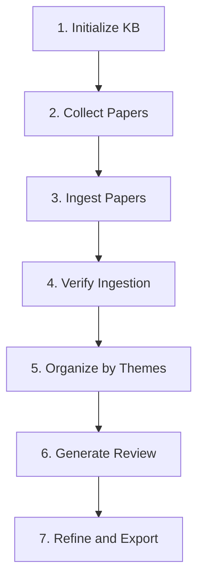

# Usage Guide - Literature Review Generator

This guide provides detailed instructions for using the Literature Review Generator application.

## Table of Contents

1. [Installation](#installation)
2. [Quick Start](#quick-start)
3. [Workflow](#workflow)
4. [Command Reference](#command-reference)
5. [Examples](#examples)
6. [Best Practices](#best-practices)
7. [Troubleshooting](#troubleshooting)

## Installation

### Prerequisites

- Python 3.8 or higher
- pip package manager

### Setup

```bash
# 1. Clone the repository (if applicable)
git clone <repository-url>
cd literature-review-app

# 2. Create and activate virtual environment
python -m venv venv

# On Linux/Mac:
source venv/bin/activate

# On Windows:
venv\Scripts\activate

# 3. Install dependencies
pip install -r requirements.txt

# 4. Create necessary directories
mkdir -p logs data/papers data/outputs
```

### Verify Installation

```bash
python src/main.py --help
```

## Quick Start

### 1. Initialize the Knowledge Base

```bash
python src/main.py init
```

This creates the SQLite database with all necessary tables and indexes.

### 2. Add Sample Paper

Create a sample text file `data/papers/sample_paper.txt`:

```text
Deep Learning for Natural Language Processing

John Doe, Jane Smith

Abstract: This paper presents a comprehensive study of deep learning
techniques applied to natural language processing tasks...

1. Introduction
Natural language processing has seen remarkable advances...

2. Methodology
We propose a novel approach using transformer architectures...

3. Results
Our experiments demonstrate state-of-the-art performance...

4. Conclusion
This work shows that deep learning can effectively...
```

### 3. Ingest the Paper

```bash
python src/main.py ingest --file data/papers/sample_paper.txt --theme "Deep Learning"
```

### 4. Generate a Review

```bash
python src/main.py generate \
  --theme "Deep Learning" \
  --output data/outputs/dl_review.md
```

## Workflow

### Complete Workflow for a Literature Review



### Step-by-Step Process

#### Step 1: Initialize Knowledge Base

```bash
python src/main.py init
```

**Output**: Creates `data/knowledge_base.db`

#### Step 2: Collect Papers

Gather papers in PDF or text format and place them in `data/papers/` directory.

Recommended structure:
```
data/papers/
├── deep_learning/
│   ├── paper1.pdf
│   ├── paper2.pdf
├── nlp/
│   ├── paper3.pdf
└── computer_vision/
    ├── paper4.pdf
```

#### Step 3: Ingest Papers

**Option A: Ingest single paper**
```bash
python src/main.py ingest \
  --file data/papers/deep_learning/paper1.pdf \
  --theme "Deep Learning,Neural Networks"
```

**Option B: Ingest entire directory**
```bash
python src/main.py ingest \
  --directory data/papers/deep_learning/ \
  --theme "Deep Learning"
```

**Best Practice**: Ingest papers in batches to monitor progress and catch errors early.

#### Step 4: Verify Ingestion

```bash
# List all papers
python src/main.py list

# View statistics
python src/main.py stats

# Check specific paper
python src/main.py show 1
```

#### Step 5: Organize by Themes

```bash
# View all themes
python src/main.py themes

# Search papers by theme
python src/main.py search --theme "Deep Learning"
```

#### Step 6: Generate Review

```bash
python src/main.py generate \
  --theme "Deep Learning" \
  --output data/outputs/deep_learning_review.md \
  --min-papers 20
```

**Options:**
- `--sections`: Generate specific sections (e.g., `intro,analysis,conclusion`)
- `--format`: Output format (currently: `markdown`)
- `--min-papers`: Minimum papers required (default: 20)

#### Step 7: Review and Refine

1. Open the generated markdown file
2. Review the content for accuracy
3. Add domain-specific details
4. Refine citations and references
5. Export to desired format (LaTeX, PDF, etc.)

## Command Reference

### `init` - Initialize Knowledge Base

```bash
python src/main.py init [--reset]
```

**Options:**
- `--reset`: Delete existing database and reinitialize

**Examples:**
```bash
# First-time initialization
python src/main.py init

# Reset and reinitialize
python src/main.py init --reset
```

### `ingest` - Ingest Papers

```bash
python src/main.py ingest [--file FILE | --directory DIR] [--theme THEMES]
```

**Options:**
- `--file`, `-f`: Path to single paper file
- `--directory`, `-d`: Path to directory containing papers
- `--theme`, `-t`: Comma-separated list of themes

**Examples:**
```bash
# Single file
python src/main.py ingest -f paper.pdf -t "Machine Learning"

# Directory
python src/main.py ingest -d papers/ -t "Deep Learning,NLP"

# Multiple themes
python src/main.py ingest -f paper.pdf -t "ML,Computer Vision"
```

### `list` - List Papers

```bash
python src/main.py list [--limit N]
```

**Options:**
- `--limit`, `-l`: Maximum papers to display (default: 50)

**Examples:**
```bash
# List all papers (up to 50)
python src/main.py list

# List first 10 papers
python src/main.py list --limit 10
```

### `show` - Show Paper Details

```bash
python src/main.py show PAPER_ID
```

**Examples:**
```bash
# Show paper with ID 1
python src/main.py show 1
```

### `themes` - List Themes

```bash
python src/main.py themes
```

**Output**: Lists all themes with paper counts

### `search` - Search Papers

```bash
python src/main.py search [--theme THEME | --keyword KEYWORD] [--limit N]
```

**Options:**
- `--theme`, `-t`: Search by theme name
- `--keyword`, `-k`: Full-text keyword search
- `--limit`, `-l`: Maximum results (default: 20)

**Examples:**
```bash
# Search by theme
python src/main.py search --theme "Deep Learning"

# Search by keyword
python src/main.py search --keyword "transformer"

# Limit results
python src/main.py search -k "neural" -l 10
```

### `generate` - Generate Review

```bash
python src/main.py generate --theme THEME --output FILE [OPTIONS]
```

**Required:**
- `--theme`, `-t`: Theme for the review
- `--output`, `-o`: Output file path

**Options:**
- `--sections`, `-s`: Sections to generate (comma-separated)
- `--format`, `-f`: Output format (default: markdown)
- `--min-papers`: Minimum papers required (default: 20)

**Examples:**
```bash
# Full review
python src/main.py generate -t "Deep Learning" -o review.md

# Specific sections only
python src/main.py generate -t "ML" -o review.md -s intro,analysis

# Custom minimum papers
python src/main.py generate -t "NLP" -o review.md --min-papers 30
```

### `stats` - Show Statistics

```bash
python src/main.py stats
```

**Output**: Displays database statistics including paper count, themes, year range

## Examples

### Example 1: Complete Literature Review on Deep Learning

```bash
# 1. Initialize
python src/main.py init

# 2. Ingest papers
python src/main.py ingest -d data/papers/deep_learning/ -t "Deep Learning"

# 3. Verify
python src/main.py stats
python src/main.py list

# 4. Generate review
python src/main.py generate \
  --theme "Deep Learning" \
  --output data/outputs/dl_review.md \
  --min-papers 25

# Output saved to: data/outputs/dl_review.md
```

### Example 2: Multi-Theme Review

```bash
# Ingest papers with multiple themes
python src/main.py ingest -d papers/ml/ -t "Machine Learning"
python src/main.py ingest -d papers/dl/ -t "Deep Learning,Machine Learning"
python src/main.py ingest -d papers/rl/ -t "Reinforcement Learning,Machine Learning"

# Generate comprehensive ML review
python src/main.py generate \
  --theme "Machine Learning" \
  --output ml_comprehensive.md
```

### Example 3: Incremental Paper Addition

```bash
# Initial batch
python src/main.py ingest -d papers/batch1/ -t "Computer Vision"

# Generate initial review
python src/main.py generate -t "Computer Vision" -o cv_v1.md

# Add more papers
python src/main.py ingest -d papers/batch2/ -t "Computer Vision"

# Generate updated review
python src/main.py generate -t "Computer Vision" -o cv_v2.md
```

## Best Practices

### Paper Collection

1. **Quality over Quantity**: Focus on high-impact papers from reputable venues
2. **Diversity**: Include papers from different perspectives and approaches
3. **Recency**: Include recent papers to reflect current state-of-the-art
4. **Completeness**: Ensure PDFs have extractable text (not scanned images)

### Theme Organization

1. **Hierarchical Themes**: Use specific themes (e.g., "Convolutional Neural Networks" rather than just "Neural Networks")
2. **Multiple Themes**: Assign multiple relevant themes to each paper
3. **Consistent Naming**: Use consistent theme names across papers

### Context Management

1. **Batch Processing**: Ingest papers in small batches (5-10 at a time)
2. **Monitor Progress**: Use `stats` command to track ingestion
3. **Verify Quality**: Use `show` command to inspect paper summaries
4. **Theme-Focused Reviews**: Generate reviews for specific themes rather than all papers at once

### Review Generation

1. **Minimum Papers**: Ensure at least 20-30 papers per theme
2. **Section-by-Section**: For very large reviews, generate sections separately
3. **Iterative Refinement**: Generate initial draft, refine, regenerate
4. **Manual Enhancement**: Add domain expertise and refine generated content

## Troubleshooting

### Issue: PDF Text Extraction Fails

**Symptoms**: Error when ingesting PDF files

**Solutions**:
```bash
# Install PDF parsing libraries
pip install PyPDF2 pdfplumber

# If PDF is scanned image, use OCR first
# (Use external OCR tool to convert to text)
```

### Issue: Insufficient Papers for Review

**Symptoms**: "Insufficient papers for review" error

**Solutions**:
```bash
# Check paper count
python src/main.py search --theme "Your Theme"

# Lower minimum papers threshold
python src/main.py generate -t "Your Theme" -o review.md --min-papers 10

# Ingest more papers
python src/main.py ingest -d more_papers/ -t "Your Theme"
```

### Issue: Theme Not Found

**Symptoms**: No papers found for theme

**Solutions**:
```bash
# List all themes
python src/main.py themes

# Use exact theme name
python src/main.py search --theme "Exact Theme Name"

# Check paper themes
python src/main.py show PAPER_ID
```

### Issue: Database Locked

**Symptoms**: "Database is locked" error

**Solutions**:
```bash
# Close other connections to database
# Kill any hanging Python processes

# Reset database if necessary
python src/main.py init --reset
```

### Issue: Out of Context/Memory

**Symptoms**: System becomes slow or unresponsive

**Solutions**:
1. Generate review for smaller theme subsets
2. Use `--sections` to generate sections separately
3. Reduce `--min-papers` threshold
4. Process papers in smaller batches

## Advanced Usage

### Programmatic Usage

```python
from src.config import get_config
from src.knowledge_base.storage import KnowledgeBase
from src.processors.paper_processor import PaperProcessor
from src.generation.review_generator import ReviewGenerator

# Initialize
config = get_config()
kb = KnowledgeBase(str(config.database_path))
kb.initialize_schema()

# Process paper
processor = PaperProcessor(kb)
paper = processor.process_paper("paper.pdf", themes=["Deep Learning"])

# Generate review
generator = ReviewGenerator(kb)
review = generator.generate_review(
    theme="Deep Learning",
    min_papers=20
)

# Save
with open("review.md", "w") as f:
    f.write(review)
```

### Custom Configuration

Edit `config.yaml` to customize behavior:

```yaml
processing:
  summary_brief_tokens: 250  # Adjust summary length
  summary_detailed_tokens: 1000

generation:
  min_papers_for_review: 20  # Default minimum
  default_format: "markdown"

context:
  max_tokens: 200000  # Context limit
```

## Getting Help

- **Documentation**: See [ARCHITECTURE.md](ARCHITECTURE.md) for system design
- **README**: See [README.md](README.md) for overview
- **Issues**: Report bugs and request features on GitHub

## Next Steps

1. Ingest your paper collection
2. Generate your first review
3. Refine and customize the output
4. Share and iterate

Happy reviewing! 📚
